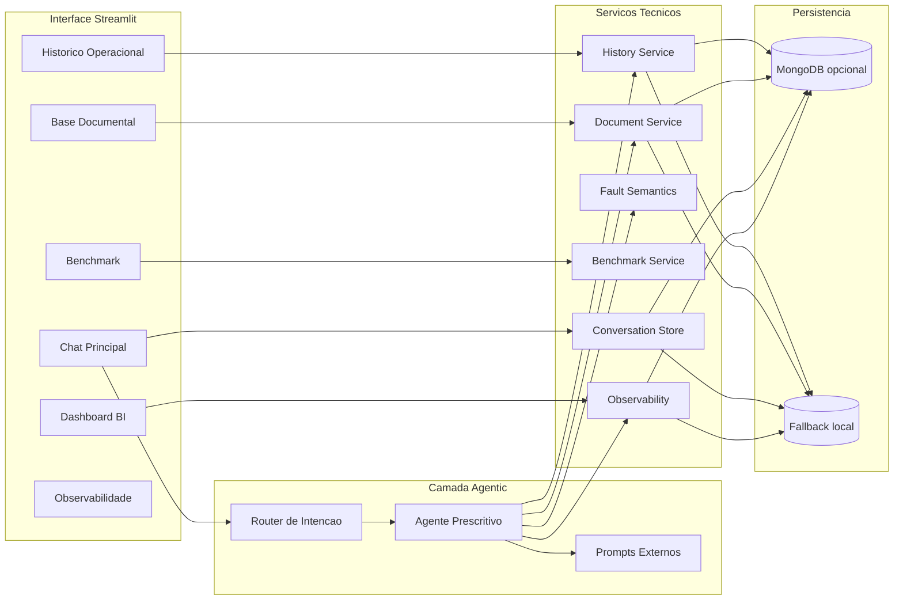

# Manutencao Prescritiva LLM-First

Aplicacao em Streamlit para manutencao prescritiva industrial com chat como superficie principal, busca historica, base documental chunkada, benchmark de modelos e rastreabilidade operacional.

O projeto foi estruturado para a prova com foco em uma leitura **LLM-first em estacao de trabalho**, usando o modelo como camada de orquestracao e sintese, com ferramentas tecnicas auxiliares para historico, validacao, semantica e RAG documental.

> A solucao foi integralmente arquitetada para rodar **on-premise (Edge)**, respeitando o limite operacional de **16 GB de VRAM** na estacao de trabalho. No repositorio, a organizacao do projeto e os pontos de integracao ja foram pensados para deploy local de modelo open-source. Entretanto, como a maquina de desenvolvimento usada nesta apresentacao possui restricoes fisicas de hardware para manter fluidez durante a demonstracao, a aplicacao foi configurada para consumir o **mesmo tipo de modelo open-source via Groq**. Na pratica, a aplicacao nao depende do provedor em si, porque o endpoint do modelo foi abstraido na camada de servico.

## Sumario

- [Problema e solucao](#problema-e-solucao)
- [Funcionalidades principais](#funcionalidades-principais)
- [Arquitetura](#arquitetura)
- [Fluxos do copiloto](#fluxos-do-copiloto)
- [Prompts e organizacao agentic](#prompts-e-organizacao-agentic)
- [Estrutura de pastas](#estrutura-de-pastas)
- [Como executar localmente](#como-executar-localmente)
- [Validacao](#validacao)
- [Documentacao produzida](#documentacao-produzida)
- [Roadmap imediato](#roadmap-imediato)

## Problema e solucao

O projeto resolve o apoio a decisao em manutencao prescritiva para maquinas rotativas a partir de:

1. eventos de sensores em JSON;
2. historico operacional com rotulos de falha;
3. documentos tecnicos usados como lastro prescritivo.

Abordagem adotada:

1. o usuario conversa com o copiloto em linguagem natural ou envia um evento JSON;
2. o agente roteia a intencao entre evento, consulta documental e duvida tecnica;
3. para eventos, o sistema valida o payload, busca vizinhos historicos e consulta chunks documentais;
4. o LLM sintetiza uma resposta rastreavel em markdown;
5. logs, benchmark e historico de conversa ficam disponiveis nas paginas auxiliares.

## Funcionalidades principais

- Chat principal com historico de conversa e nova conversa pela sidebar.
- Resposta em markdown com estilo operacional para PCP e manutencao.
- Roteamento de intencao entre `event_json`, `document_query` e `freeform_question`.
- Busca historica sobre `data/raw/banner.csv` com normalizacao semantica de falhas.
- Base documental com ingestao de PDFs, chunking e busca vetorial local.
- MongoDB opcional para persistencia de historico, documentos, chunks, conversas e logs.
- Benchmark de modelos Groq para comparar latencia, uso e aderencia.
- Observabilidade com logs locais e colecoes persistidas.
- UI multipage em Streamlit com sidebar compartilhada.

## Arquitetura



## Fluxos do copiloto

### 1. Evento JSON

1. normaliza o payload;
2. valida grandezas fisicas;
3. recupera vizinhos historicos;
4. escolhe falha candidata;
5. busca chunks documentais aderentes;
6. gera resposta prescritiva com confianca, rastreio e limitacoes.

### 2. Consulta documental

Exemplo: `quais documentos tem na base de dados?`

1. consulta a base indexada;
2. lista documentos e trechos aderentes;
3. responde sem exigir JSON;
4. deixa claro quando ha ou nao lastro.

### 3. Duvida tecnica livre

Exemplo: `o que e FFT?`

1. nao trata a pergunta como evento;
2. usa chunks documentais quando encontrar suporte;
3. responde tecnicamente em markdown;
4. explicita limitacao se a base nao sustentar a resposta.

## Prompts e organizacao agentic

Inspirado na organizacao do repositorio `gufsousa/projeto-ia-gen` e na referencia local `C:\Projetos\Manutencao-prescritva`, os prompts ficam fora do codigo Python para facilitar iteracao.

Arquivos principais:

- [prompts/maintenance_event_system.md](C:\Projetos\Manutencao-prescritiva-main\prompts\maintenance_event_system.md)
- [prompts/freeform_system.md](C:\Projetos\Manutencao-prescritiva-main\prompts\freeform_system.md)
- [prompts/input_router.md](C:\Projetos\Manutencao-prescritiva-main\prompts\input_router.md)
- [prompts/prescriptive_response_few_shot.md](C:\Projetos\Manutencao-prescritiva-main\prompts\prescriptive_response_few_shot.md)
- [src/prompt_loader.py](C:\Projetos\Manutencao-prescritiva-main\src\prompt_loader.py)

Isso permite:

- ajustar o papel do agente sem editar o core;
- evoluir para um planner estilo ReAct mais explicito;
- versionar politica, few-shot e roteamento de forma auditavel.

## Estrutura de pastas

- `Home.py`: pagina principal do chat.
- `pages/`: dashboard, diagnostico, base documental, historico, benchmark e observabilidade.
- `src/agent_service.py`: motor principal do copiloto.
- `src/history_service.py`: ingestao e busca historica.
- `src/document_service.py`: ingestao de PDFs, chunking e busca vetorial.
- `src/fault_semantics.py`: canonizacao de falhas.
- `src/mongo_store.py`: persistencia MongoDB com fallback local.
- `src/sidebar.py`: sidebar compartilhada entre paginas.
- `src/ui.py`: tema e estilos comuns.
- `config/fault_lexicon.yaml`: taxonomia de falhas.
- `data/raw/`: dataset e PDFs base.
- `docs/analise_markdown/`: analises e confrontos da prova.
- `tests/smoke_test.py`: teste de fumaca end-to-end.

## Como executar localmente

### Requisitos

- Python `3.12+`
- acesso a internet para Groq
- opcional: MongoDB Atlas ou instancia local

### 1. Criar ambiente virtual

```powershell
python -m venv .venv
.venv\Scripts\Activate.ps1
python -m pip install --upgrade pip
```

Se o PowerShell bloquear a ativacao:

```powershell
Set-ExecutionPolicy -Scope Process Bypass
.venv\Scripts\Activate.ps1
```

### 2. Instalar dependencias

```powershell
python -m pip install -r requirements.txt
```

### 3. Configurar ambiente

```powershell
Copy-Item .env.example .env
```

Campos principais em `.env`:

- `GROQ_API_KEY`
- `DEFAULT_LLM_MODEL`
- `FALLBACK_LLM_MODELS`
- `MONGO_CONNECTION_STRING`
- `MONGO_DATABASE`
- `MONGO_ENABLED`
- `TOP_K_DOCUMENTS`
- `TOP_K_HISTORY`

Para rodar sem Mongo:

```env
MONGO_ENABLED=false
```

### 4. Rodar o app

```powershell
python -m streamlit run Home.py
```

Depois abra:

```text
http://localhost:8501
```

## Validacao

### Teste de fumaca

```powershell
python tests\smoke_test.py
```

Valida:

- ingestao do historico;
- ingestao documental;
- busca historica;
- busca documental;
- inferencia do agente;
- observabilidade.

### Compilacao

```powershell
python -m compileall Home.py pages src tests
```

## Documentacao produzida

- [docs/analise_markdown/01_visao_geral_repositorio.md](C:\Projetos\Manutencao-prescritiva-main\docs\analise_markdown\01_visao_geral_repositorio.md)
- [docs/analise_markdown/02_crisp_dm_detalhado.md](C:\Projetos\Manutencao-prescritiva-main\docs\analise_markdown\02_crisp_dm_detalhado.md)
- [docs/analise_markdown/03_analise_exploratoria_insights.md](C:\Projetos\Manutencao-prescritiva-main\docs\analise_markdown\03_analise_exploratoria_insights.md)
- [docs/analise_markdown/04_confronto_literatura_web.md](C:\Projetos\Manutencao-prescritiva-main\docs\analise_markdown\04_confronto_literatura_web.md)
- [docs/analise_markdown/05_plano_mvp_streamlit_llm_first.md](C:\Projetos\Manutencao-prescritiva-main\docs\analise_markdown\05_plano_mvp_streamlit_llm_first.md)
- [docs/analise_markdown/06_referencia_interface_streamlit_bi.md](C:\Projetos\Manutencao-prescritiva-main\docs\analise_markdown\06_referencia_interface_streamlit_bi.md)
- [docs/analise_markdown/07_plano_implementacao_mvp_streamlit.md](C:\Projetos\Manutencao-prescritiva-main\docs\analise_markdown\07_plano_implementacao_mvp_streamlit.md)

## Roadmap imediato

- melhorar a qualidade da resposta tecnica livre quando o termo consultado nao estiver explicitamente nos PDFs;
- introduzir politica agentic configuravel em `config/agent_policy.yaml`;
- evoluir do router atual para um planner estilo ReAct mais explicito;
- adicionar avaliacao mais forte para falso positivo e casos `unknown`.

## Referencias

- Repositorio de interface e documentacao usado como referencia estrutural: [gufsousa/projeto-ia-gen](https://github.com/gufsousa/projeto-ia-gen)
- Repositorio local usado como referencia para organizacao agentic e prompts: `C:\Projetos\Manutencao-prescritva`
