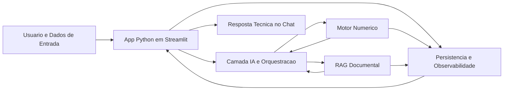
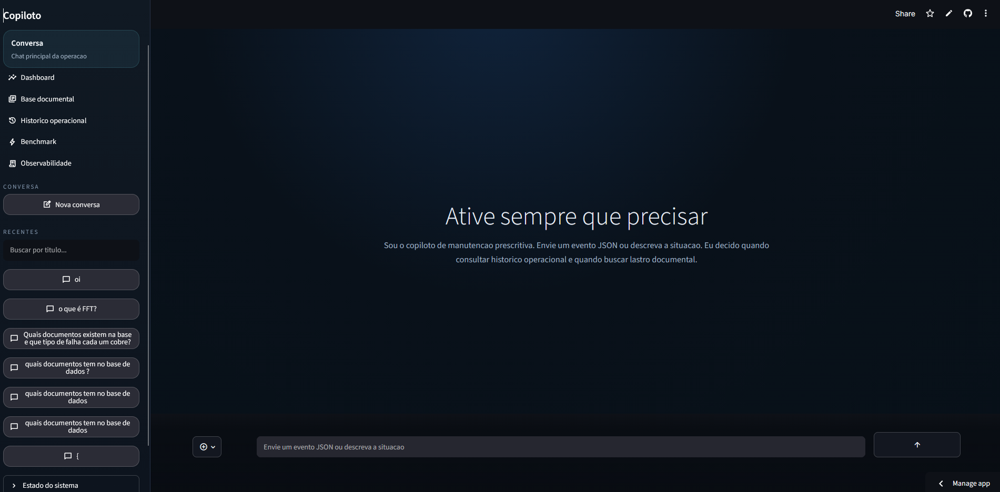
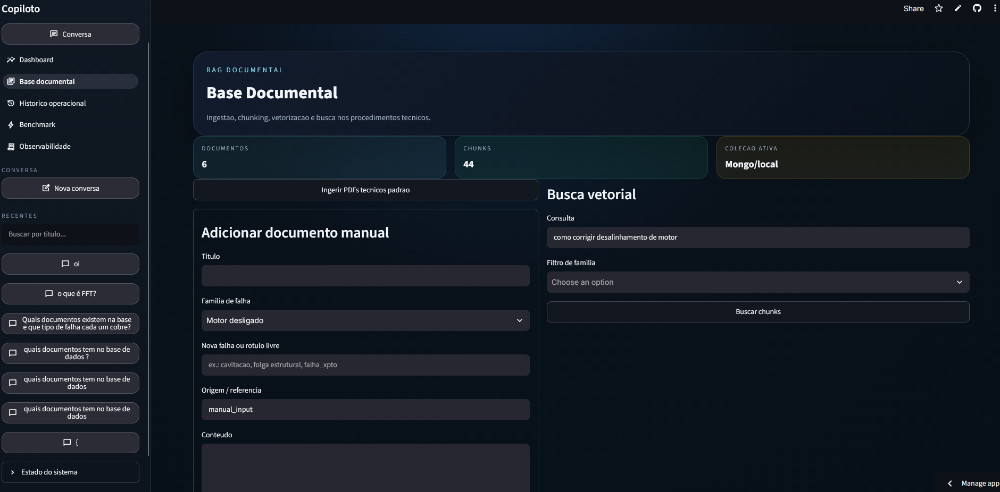
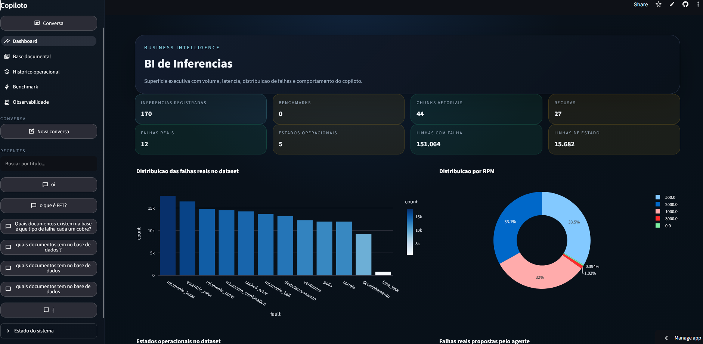

# Manutencao Prescritiva LLM-First


Aplicacao em Streamlit para manutencao prescritiva industrial com chat como superficie principal, busca historica, base documental chunkada, benchmark de modelos e rastreabilidade operacional.

O projeto foi estruturado para a prova com foco em uma leitura **LLM-first em estacao de trabalho**, usando o modelo como camada de orquestracao e sintese, com ferramentas tecnicas auxiliares para historico, validacao, semantica e RAG documental.

> A solucao foi arquitetada para rodar **on-premise (Edge)**, respeitando o limite operacional de **16 GB de VRAM** na estacao de trabalho. O repositorio ja separa a camada de modelo da aplicacao, permitindo alternancia entre execucao remota via `Groq` e execucao local via `Ollama`, sem acoplamento forte ao provedor.

**Deploy Streamlit Cloud**: https://manutencao-prescritiva-lqwura4kbh7d6zrhdzngxa.streamlit.app/

## Sumario

- [Problema e solucao](#problema-e-solucao)
- [Funcionalidades principais](#funcionalidades-principais)
- [Python e bibliotecas principais](#python-e-bibliotecas-principais)
- [Arquitetura](#arquitetura)
- [Screenshots](#screenshots)
- [Fluxos do copiloto](#fluxos-do-copiloto)
- [Prompts e organizacao agentic](#prompts-e-organizacao-agentic)
- [Estrutura de pastas](#estrutura-de-pastas)
- [Observabilidade e logs](#observabilidade-e-logs)
- [Deploy](#deploy)
- [Como executar localmente](#como-executar-localmente)
- [Validacao](#validacao)
- [Analise exploratoria e insights](#analise-exploratoria-e-insights)
- [Benchmark das tecnicas](#benchmark-das-tecnicas)
- [Qualidade atual e melhorias futuras](#qualidade-atual-e-melhorias-futuras)
- [Documentacao produzida](#documentacao-produzida)
- [Roadmap imediato](#roadmap-imediato)

## Problema e solucao

O projeto resolve o apoio a decisao em manutencao prescritiva para maquinas rotativas a partir de:

1. eventos de sensores em JSON;
2. historico operacional com rotulos de falha;
3. documentos tecnicos usados como lastro prescritivo.

Abordagem adotada:

1. o usuario conversa com o copiloto em linguagem natural ou envia um evento JSON;
2. o agente roteia a intencao entre evento, consulta documental e duvida tecnica;
3. para eventos, o sistema valida o payload, busca vizinhos historicos e consulta chunks documentais;
4. o LLM sintetiza uma resposta rastreavel em markdown;
5. logs, benchmark e historico de conversa ficam disponiveis nas paginas auxiliares.

Observacao importante sobre o dado de entrada:

- o case forneceu **features estatisticas ja extraidas** dos sensores em `banner.csv`, e nao os sinais brutos de vibracao;
- por isso, a implementacao do motor diagnostico foi feita sobre as variaveis disponiveis no dataset;
- abordagens classicas do dominio, como **FFT**, envelope e assinaturas espectrais de falha, fazem muito sentido para maquinas rotativas, mas ficaram fora da implementacao direta porque o insumo bruto necessario nao foi disponibilizado;
- nesse contexto, o **LLM** foi posicionado principalmente como camada de **orquestracao, explicacao e prescricao textual**, e nao como substituto do motor numerico.

## Funcionalidades principais

- Chat principal com historico de conversa e nova conversa pela sidebar.
- Resposta em markdown com rastreio tecnico e limitacoes explicitas.
- Roteamento de intencao entre `event_json`, `document_query` e `freeform_question`.
- Busca historica sobre `data/raw/banner.csv` com normalizacao semantica de falhas.
- Motor historico com `Mahalanobis + k-NN ponderado + OOD` para decisao numerica auditavel.
- Base documental com ingestao de PDFs, chunking e busca vetorial local.
- MongoDB opcional para persistencia de historico, documentos, chunks, conversas e logs.
- Abstracao de provedor de LLM para alternar entre Groq e Ollama local.
- Benchmark de tecnicas estatisticas, Groq e Ollama para comparar latencia, uso e aderencia.
- Observabilidade com logs locais e colecoes persistidas.
- UI multipage em Streamlit com sidebar compartilhada.

## Python e bibliotecas principais

O projeto foi construido em `Python`, com bibliotecas escolhidas para cobrir interface, dados, IA aplicada e persistencia:

| Biblioteca | Papel no projeto |
| --- | --- |
| `streamlit` | camada de interface da aplicacao, com chat, paginas auxiliares, tabelas e operacao multipage |
| `pandas` | manipulacao tabular do `banner.csv`, filtros, cargas, benchmark e visualizacao operacional |
| `numpy` | suporte numerico para vetores, distancias e calculos do motor historico |
| `scikit-learn` | escalonamento com `StandardScaler` e vetorizacao textual com `HashingVectorizer` |
| `pypdf` | leitura e extracao de texto dos PDFs usados na base documental |
| `pymongo` | integracao com MongoDB para persistencia opcional de historico, documentos, chunks, conversas e logs |
| `python-dotenv` | carregamento das configuracoes do `.env`, incluindo provider LLM, Mongo e parametros da aplicacao |
| `PyYAML` | leitura da taxonomia semantica de falhas em `config/fault_lexicon.yaml` |
| `groq` | acesso ao provider remoto usado na demonstracao quando o fluxo roda com API |
| `plotly` | apoio para graficos e visualizacoes nas paginas analiticas e de benchmark |

## Arquitetura



## Screenshots

### Chat principal



### Base documental



### Dashboard e BI



## Fluxos do copiloto

### 1. Evento JSON

1. normaliza o payload;
2. valida grandezas fisicas;
3. recupera vizinhos historicos;
4. escolhe falha candidata;
5. busca chunks documentais aderentes;
6. gera resposta prescritiva com confianca, rastreio e limitacoes.

### 2. Consulta documental

Exemplo: `quais documentos tem na base de dados?`

1. consulta a base indexada;
2. lista documentos e trechos aderentes;
3. responde sem exigir JSON;
4. deixa claro quando ha ou nao lastro.

### 3. Duvida tecnica livre

Exemplo: `o que e FFT?`

1. nao trata a pergunta como evento;
2. usa chunks documentais quando encontrar suporte;
3. responde tecnicamente em markdown;
4. explicita limitacao se a base nao sustentar a resposta.

## Prompts e organizacao agentic

Os prompts ficam fora do codigo Python para facilitar iteracao.

Arquivos principais:

- [prompts/maintenance_event_system.md](prompts/maintenance_event_system.md)
- [prompts/freeform_system.md](prompts/freeform_system.md)
- [prompts/input_router.md](prompts/input_router.md)
- [prompts/prescriptive_response_few_shot.md](prompts/prescriptive_response_few_shot.md)
- [src/prompt_loader.py](src/prompt_loader.py)

Isso permite:

- ajustar o papel do agente sem editar o core;
- evoluir para um planner estilo ReAct mais explicito;
- versionar politica, few-shot e roteamento de forma auditavel.

## Estrutura de pastas

O repositorio pode ser entendido assim:

```text
Manutencao-prescritiva-main/
|-- Home.py                         # Entrada principal do chat em Streamlit
|-- pages/                          # Superficies da aplicacao
|   |-- 1_BI_de_Inferencias.py      # Dashboard de inferencias
|   |-- 3_Base_Documental.py        # Consulta e ingestao documental
|   |-- 4_Historico_Operacional.py  # Historico, ingestao e vizinhos
|   |-- 5_Benchmark_de_Modelos.py   # Comparacao de tecnicas e modelos
|   `-- 6_Observabilidade.py        # Logs e rastreabilidade
|-- src/                            # Nucleo Python da aplicacao
|   |-- agent_service.py            # Orquestracao IA e resposta final
|   |-- history_service.py          # Motor numerico historico
|   |-- document_service.py         # RAG documental local
|   |-- vectorization.py            # Vetorizacao local e similaridade
|   |-- fault_semantics.py          # Canonizacao semantica de falhas
|   |-- prompt_loader.py            # Carga de prompts externos
|   |-- mongo_store.py              # Persistencia MongoDB e fallback local
|   |-- conversation_store.py       # Persistencia de conversas
|   |-- observability.py            # Logs de inferencia e benchmark
|   |-- sidebar.py                  # Navegacao compartilhada
|   `-- ui.py                       # Tema e componentes visuais comuns
|-- prompts/                        # Prompts versionados do agente
|   |-- input_router.md             # Roteamento de intencao
|   |-- maintenance_event_system.md # Prompt principal para evento
|   |-- freeform_system.md          # Prompt para perguntas tecnicas
|   `-- prescriptive_response_few_shot.md
|-- config/                         # Configuracao declarativa
|   `-- fault_lexicon.yaml          # Taxonomia e aliases de falhas
|-- data/                           # Dados locais do projeto
|   |-- raw/                        # Dataset banner.csv e PDFs base
|   `-- app_state/                  # Estado local, logs e fallback
|-- scripts/                        # Automacoes de benchmark e apoio
|-- tests/                          # Validacao automatizada
|   `-- smoke_test.py               # Teste de fumaca end-to-end
|-- docs/                           # Documentacao da prova
|   `-- analise_markdown/           # Analises tecnicas e benchmarks
|-- .env.example                    # Exemplo de configuracao local
|-- requirements.txt                # Dependencias Python
`-- README.md                       # Visao geral do projeto
```

## Observabilidade e logs

O projeto registra inferencias e benchmarks em dois niveis:

- persistencia opcional no `MongoDB`;
- fallback local em `jsonl`.

Colecoes usadas no Mongo:

- `historical_events`: historico operacional persistido;
- `documents`: metadados e conteudo dos documentos;
- `document_chunks`: chunks documentais com vetores locais;
- `inference_logs`: logs de inferencia;
- `benchmark_runs`: logs de benchmark;
- `conversations`: historico de conversa.

Arquivos locais principais:

- `data/app_state/logs/inference_logs.jsonl`
- `data/app_state/logs/benchmark_logs.jsonl`

Campos mais relevantes nos logs de inferencia:

- `created_at`
- `model`
- `elapsed_ms`
- `probable_fault`
- `confidence_pct`
- `documents_count`
- `history_neighbors`
- `refusal_reason`
- `usage`

Leitura pratica:

- os logs ajudam a auditar se a resposta teve base historica e documental;
- os CSVs em `docs/analise_markdown/` resumem os experimentos de benchmark ja executados;
- os graficos HTML em `docs/analise_markdown/benchmark_graficos_2026-08-05/` servem como apoio visual para apresentacao e comparacao entre tecnicas.

## Deploy

- **Aplicacao publicada**: https://manutencao-prescritiva-lqwura4kbh7d6zrhdzngxa.streamlit.app/
- o deploy foi feito em `Streamlit Cloud` para facilitar a demonstracao e a avaliacao do projeto;
- a aplicacao pode operar com `MongoDB` opcional ou fallback local, dependendo da configuracao disponivel no ambiente.

## Como executar localmente

### Requisitos

- Python `3.12+`
- acesso a internet para Groq quando `LLM_PROVIDER=groq`
- opcional: Ollama local quando `LLM_PROVIDER=ollama`
- opcional: MongoDB Atlas ou instancia local

### 1. Criar ambiente virtual

```powershell
python -m venv .venv
.venv\Scripts\Activate.ps1
python -m pip install --upgrade pip
```

Se o PowerShell bloquear a ativacao:

```powershell
Set-ExecutionPolicy -Scope Process Bypass
.venv\Scripts\Activate.ps1
```

### 2. Instalar dependencias

```powershell
python -m pip install -r requirements.txt
```

### 3. Configurar ambiente

```powershell
Copy-Item .env.example .env
```

Campos principais em `.env`:

- `LLM_PROVIDER`
- `GROQ_API_KEY`
- `OLLAMA_BASE_URL`
- `DEFAULT_LLM_MODEL`
- `FALLBACK_LLM_MODELS`
- `MONGO_CONNECTION_STRING`
- `MONGO_DATABASE`
- `MONGO_ENABLED`
- `TOP_K_DOCUMENTS`
- `TOP_K_HISTORY`

Para rodar sem Mongo:

```env
MONGO_ENABLED=false
```

Para rodar com Ollama local:

```env
LLM_PROVIDER=ollama
DEFAULT_LLM_MODEL=llama3.1:latest
OLLAMA_BASE_URL=http://localhost:11434
```

### 4. Rodar o app

```powershell
python -m streamlit run Home.py
```

Depois abra:

```text
http://localhost:8501
```

## Validacao

### Teste de fumaca

```powershell
python tests\smoke_test.py
```

Valida:

- ingestao do historico;
- ingestao documental;
- busca historica;
- busca documental;
- inferencia do agente;
- observabilidade.

### Compilacao

```powershell
python -m compileall Home.py pages src tests
```

## Analise exploratoria e insights

A analise exploratoria foi mantida como apoio ao entendimento do problema, e nao como fim em si.

- o `banner.csv` concentra features estatisticas ja extraidas de sensores, sem sinal bruto;
- a base possui distribuicao relevante por familia de falha e por faixa operacional, o que justifica o uso de busca historica supervisionada por similaridade;
- os insights exploratorios ajudaram a definir o recorte MVP: diagnostico numerico auditavel, RAG documental local e LLM como camada de sintese.

Leitura curta:

- a exploratoria serviu para entender o dado e orientar a arquitetura;
- ela nao substitui o motor diagnostico nem o benchmark final.

## Benchmark das tecnicas

O benchmark foi incluido para comparar tecnicas numericas e pipelines com LLM no mesmo problema.

- tecnicas puramente numericas funcionam como baseline auditavel;
- o pipeline `llm_vector_rag` mede o ganho de camada semantica e de explicacao;
- o contraste entre `Groq` e `Ollama` ajuda a discutir trade-off entre qualidade e execucao local.

Resultado de leitura rapida em **5 de agosto de 2026**:

- o melhor resultado geral foi `mahalanobis_weighted_knn` com `accuracy=0.92` e `macro_f1=0.9195`;
- o melhor pipeline LLM foi `llm_vector_rag_groq` com `llama-3.1-8b-instant`, em `accuracy=0.74`;
- isso reforca a decisao arquitetural de manter o motor numerico como nucleo diagnostico e o LLM como camada de orquestracao e explicacao.

Leitura adicional sobre classes proximas:

- no proprio dataset, algumas familias ficam proximas no espaco de features ja extraidas;
- exemplos observados na analise numerica: `cocked_rotor <-> correia`, `rolamento_inner <-> rolamento_ball`, `rolamento_inner <-> rolamento_outer`, `desalinhamento <-> normal` e `desbalanceamento <-> polia`;
- no benchmark atual, o `llm_vector_rag_groq` nao resolveu melhor essas ambiguidades do que o motor numerico;
- as principais confusoes observadas no pipeline LLM foram `desbalanceamento -> desalinhamento`, `cocked_rotor -> rolamento_inner` e `rolamento_inner -> correia/desalinhamento`;
- isso sugere que o gargalo principal hoje esta mais na separacao estatistica das classes, na representacao das features e no corpus de lastro do que apenas na troca do modelo gerador.

## Qualidade atual e melhorias futuras

Na matriz ampliada de `110` testes automatizados, o projeto fechou:

- `110/110 PASS`
- `0/110 FAIL`

Leitura pratica:

- o fluxo principal do copiloto, os guardrails fisicos, o catalogo documental e a comparacao Python vs Mongo ficaram consistentes;
- os casos que antes falhavam foram estabilizados com roteamento deterministico melhor, guardrails documentais mais secos, ajuste no uso do historico persistido e respostas livres mais naturais.
- a rodada mais recente de QA tambem mostrou que perguntas documentais como `liste documentos de rolamentos` ficaram mais aderentes ao catalogo, com menos respostas genericas.
- a matriz automatizada fechou `110/110`, embora a camada textual ainda tenha pontos de refinamento em alguns blocos de sintese.

Pontos positivos observados nos testes mais recentes:

- quando existe documento tecnicamente mapeado para a familia inferida, o copiloto consegue citar o lastro correto e sintetizar a prescricao com acoes mais concretas;
- quando nao existe documento mapeado, o fluxo atual ja evita prescricao forte e explicita a limitacao de lastro documental;
- casos de `OOD` e eventos fisicamente incoerentes tendem a ser bloqueados ou rebaixados em confianca, reduzindo risco de recomendacao automatica indevida;
- a separacao entre motor numerico, base documental e camada de resposta ficou mais clara e mais auditavel do que nas primeiras iteracoes.

Achado estrutural importante:

- parte dos erros anteriores nao vinha apenas da proximidade entre classes;
- a busca historica estava comparando alguns testes contra um historico parcial persistido no Mongo, enquanto a amostra de avaliacao vinha do dataset completo;
- a inferencia historica agora volta automaticamente para o `CSV` completo quando a cobertura persistida ainda nao estiver praticamente sincronizada, evitando enviesar o diagnostico por amostragem incompleta.

Melhorias futuras recomendadas:

- revisar a separacao entre `rolamento_inner` e `rolamento_outer`, alem de casos frageis como `cocked_rotor` e `polia`;
- revisar pares estruturalmente proximos no dataset, como `cocked_rotor/correia`, `rolamento_inner/rolamento_outer` e `desbalanceamento/polia`;
- evoluir de features estatisticas resumidas para representacoes mais discriminativas quando houver sinal bruto, como FFT, envelope e bandas de frequencia;
- endurecer ainda mais a politica para classes novas, OOD e open-set, evitando forcar classificacao quando o evento fugir do envelope conhecido;
- definir uma politica mais explicita para conflitos entre `state`, `fault` e `OOD`.

Limitacoes atuais da camada de prompt:

- o ajuste via prompt e `few-shot` melhorou a naturalidade e a organizacao geral da resposta, mas ainda nao elimina totalmente alucinacoes pontuais em blocos textuais;
- em especial, blocos como `Base da decisao`, `Checklist de inspecao` e `Riscos e limitacoes` ainda podem ficar mais soltos do que o ideal quando o modelo tenta resumir chunks longos ou incompletos;
- isso significa que, mesmo com guardrails deterministas, a camada gerativa ainda pode reformular sinais documentais como se fossem evidencias observadas diretamente no evento;
- por esse motivo, a arquitetura ainda se beneficia de mais especializacao por papel, reduzindo a liberdade do modelo em campos sensiveis.

## Documentacao produzida

- [docs/analise_markdown/01_visao_geral_repositorio.md](docs/analise_markdown/01_visao_geral_repositorio.md)
- [docs/analise_markdown/02_crisp_dm_detalhado.md](docs/analise_markdown/02_crisp_dm_detalhado.md)
- [docs/analise_markdown/03_analise_exploratoria_insights.md](docs/analise_markdown/03_analise_exploratoria_insights.md)
- [docs/analise_markdown/04_confronto_literatura_web.md](docs/analise_markdown/04_confronto_literatura_web.md)
- [docs/analise_markdown/05_plano_mvp_streamlit_llm_first.md](docs/analise_markdown/05_plano_mvp_streamlit_llm_first.md)
- [docs/analise_markdown/06_referencia_interface_streamlit_bi.md](docs/analise_markdown/06_referencia_interface_streamlit_bi.md)
- [docs/analise_markdown/07_plano_implementacao_mvp_streamlit.md](docs/analise_markdown/07_plano_implementacao_mvp_streamlit.md)
- [docs/analise_markdown/08_pente_fino_tecnico_banca.md](docs/analise_markdown/08_pente_fino_tecnico_banca.md)
- [docs/analise_markdown/09_benchmark_full_inferencia_2026-08-05.md](docs/analise_markdown/09_benchmark_full_inferencia_2026-08-05.md)
- [docs/analise_markdown/10_benchmark_groq_model_sweep_2026-08-05.md](docs/analise_markdown/10_benchmark_groq_model_sweep_2026-08-05.md)
- [docs/analise_markdown/11_relatorio_qa_guardrails_2026-08-06.md](docs/analise_markdown/11_relatorio_qa_guardrails_2026-08-06.md)
- [docs/analise_markdown/13_relatorio_qa_naturalidade_react_2026-08-06.md](docs/analise_markdown/13_relatorio_qa_naturalidade_react_2026-08-06.md)
- [docs/analise_markdown/viz_vizinhos_2026-08-06/README.md](docs/analise_markdown/viz_vizinhos_2026-08-06/README.md)

## Benchmark resumido

Resultado de referencia em **5 de agosto de 2026** na bateria de 50 amostras balanceadas:

- `euclidean_knn`: `accuracy=0.80`, `macro_f1=0.8027`
- `cosine_knn`: `accuracy=0.80`, `macro_f1=0.7942`
- `mahalanobis_weighted_knn`: `accuracy=0.92`, `macro_f1=0.9195`
- `llm_vector_rag_groq` com `llama-3.1-8b-instant`: `accuracy=0.74`, `macro_f1=0.7443`
- `llm_vector_rag_ollama_small` com `qwen2.5-coder:7b`: `accuracy=0.68`, `macro_f1=0.6900`

Sweep adicional Groq em **5 de agosto de 2026**:

- `llama-3.1-8b-instant`: melhor Groq no pipeline atual
- `llama-3.3-70b-versatile`: segundo lugar, bem proximo
- `openai/gpt-oss-120b`: execucao parcial por limite de TPM
- `openai/gpt-oss-20b`: abaixo dos dois Llama
- `qwen/qwen3.6-27b`: baixa aderencia ao prompt atual

## Roadmap imediato

- separar melhor consulta de catalogo documental e busca por chunks;
- adicionar avaliacao da qualidade da recuperacao antes da resposta final;
- reforcar a leitura arquitetural em trilhas paralelas, deixando interface, persistencia e observabilidade menos dependentes da camada gerativa;
- evoluir de ranking local para busca hibrida e, depois, ANN vetorial para escala maior;
- reforcar abstencao em casos `OOD`, baixa evidencia e features faltantes;
- testar planejamento leve antes de considerar um fluxo agentic completo estilo `ReAct`.
- avaliar especializacao por etapa entre classificacao, leitura documental e reescrita final da resposta.

Observacao importante:

- hoje o `MongoDB` funciona como camada de persistencia opcional para documentos, chunks, conversas e logs;
- no estado atual, o cluster gratuito ja comporta o historico operacional persistido, incluindo a colecao `historical_events` com cerca de `134 mil` registros;
- a busca vetorial ainda e executada na aplicacao Python com vetorizacao local e similaridade cosseno;
- no comparativo ponta a ponta com `20` amostras, trocar o ranking documental de `Python` para `MongoDB Atlas Vector Search` nao trouxe mudanca relevante de qualidade nesta base;
- o ganho potencial do `MongoDB Vector Search` aparece mais em escalabilidade, filtros nativos, busca hibrida e reducao de carga no backend Python;
- uma evolucao natural de arquitetura e mover essa etapa para `MongoDB Vector Search` nativo, mantendo o restante do pipeline.
