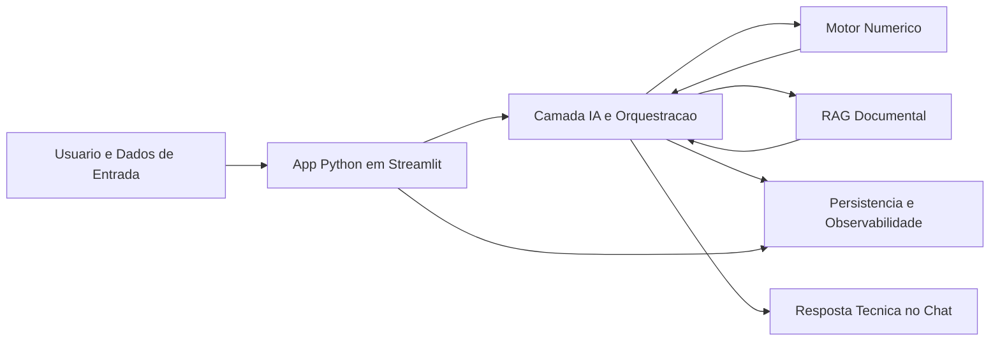

# Manutencao Prescritiva LLM-First


Aplicacao em Streamlit para manutencao prescritiva industrial com chat como superficie principal, busca historica, base documental chunkada, benchmark de modelos e rastreabilidade operacional.

O projeto foi estruturado para a prova com foco em uma leitura **LLM-first em estacao de trabalho**, usando o modelo como camada de orquestracao e sintese, com ferramentas tecnicas auxiliares para historico, validacao, semantica e RAG documental.

> A solucao foi integralmente arquitetada para rodar **on-premise (Edge)**, respeitando o limite operacional de **16 GB de VRAM** na estacao de trabalho. No repositorio, a organizacao do projeto e os pontos de integracao ja foram pensados para deploy local de modelo open-source. Entretanto, como a maquina de desenvolvimento usada nesta apresentacao possui restricoes fisicas de hardware para manter fluidez durante a demonstracao, a aplicacao foi configurada para consumir o **mesmo tipo de modelo open-source via Groq**. Na pratica, a aplicacao nao depende do provedor em si, porque o endpoint do modelo foi abstraido na camada de servico.

## Sumario

- [Problema e solucao](#problema-e-solucao)
- [Funcionalidades principais](#funcionalidades-principais)
- [Python e bibliotecas principais](#python-e-bibliotecas-principais)
- [Arquitetura](#arquitetura)
- [Fluxos do copiloto](#fluxos-do-copiloto)
- [Prompts e organizacao agentic](#prompts-e-organizacao-agentic)
- [Estrutura de pastas](#estrutura-de-pastas)
- [Como executar localmente](#como-executar-localmente)
- [Deploy no Streamlit Community Cloud](#deploy-no-streamlit-community-cloud)
- [Validacao](#validacao)
- [Analise exploratoria e insights](#analise-exploratoria-e-insights)
- [Benchmark das tecnicas](#benchmark-das-tecnicas)
- [Documentacao produzida](#documentacao-produzida)
- [Roadmap imediato](#roadmap-imediato)

## Problema e solucao

O projeto resolve o apoio a decisao em manutencao prescritiva para maquinas rotativas a partir de:

1. eventos de sensores em JSON;
2. historico operacional com rotulos de falha;
3. documentos tecnicos usados como lastro prescritivo.

Abordagem adotada:

1. o usuario conversa com o copiloto em linguagem natural ou envia um evento JSON;
2. o agente roteia a intencao entre evento, consulta documental e duvida tecnica;
3. para eventos, o sistema valida o payload, busca vizinhos historicos e consulta chunks documentais;
4. o LLM sintetiza uma resposta rastreavel em markdown;
5. logs, benchmark e historico de conversa ficam disponiveis nas paginas auxiliares.

Observacao importante sobre o dado de entrada:

- o case forneceu **features estatisticas ja extraidas** dos sensores em `banner.csv`, e nao os sinais brutos de vibracao;
- por isso, a implementacao do motor diagnostico foi feita sobre as variaveis disponiveis no dataset;
- abordagens classicas do dominio, como **FFT**, envelope e assinaturas espectrais de falha, fazem muito sentido para maquinas rotativas, mas ficaram fora da implementacao direta porque o insumo bruto necessario nao foi disponibilizado;
- nesse contexto, o **LLM** foi posicionado principalmente como camada de **orquestracao, explicacao e prescricao textual**, e nao como substituto do motor numerico.

## Funcionalidades principais

- Chat principal com historico de conversa e nova conversa pela sidebar.
- Resposta em markdown com estilo operacional para PCP e manutencao.
- Roteamento de intencao entre `event_json`, `document_query` e `freeform_question`.
- Busca historica sobre `data/raw/banner.csv` com normalizacao semantica de falhas.
- Motor historico com `Mahalanobis + k-NN ponderado + OOD` para decisao numerica auditavel.
- Base documental com ingestao de PDFs, chunking e busca vetorial local.
- MongoDB opcional para persistencia de historico, documentos, chunks, conversas e logs.
- Abstracao de provedor de LLM para alternar entre Groq e Ollama local.
- Benchmark de tecnicas estatisticas, Groq e Ollama para comparar latencia, uso e aderencia.
- Observabilidade com logs locais e colecoes persistidas.
- UI multipage em Streamlit com sidebar compartilhada.

## Python e bibliotecas principais

O projeto foi construido em `Python`, com bibliotecas escolhidas para cobrir interface, dados, IA aplicada e persistencia:

| Biblioteca | Papel no projeto |
| --- | --- |
| `streamlit` | camada de interface da aplicacao, com chat, paginas auxiliares, tabelas e operacao multipage |
| `pandas` | manipulacao tabular do `banner.csv`, filtros, cargas, benchmark e visualizacao operacional |
| `numpy` | suporte numerico para vetores, distancias e calculos do motor historico |
| `scikit-learn` | escalonamento com `StandardScaler` e vetorizacao textual com `HashingVectorizer` |
| `pypdf` | leitura e extracao de texto dos PDFs usados na base documental |
| `pymongo` | integracao com MongoDB para persistencia opcional de historico, documentos, conversas e logs |
| `python-dotenv` | carregamento das configuracoes do `.env`, incluindo provider LLM, Mongo e parametros da aplicacao |
| `PyYAML` | leitura da taxonomia semantica de falhas em `config/fault_lexicon.yaml` |
| `groq` | acesso ao provider remoto usado na demonstracao quando o fluxo roda com API |
| `plotly` | apoio para graficos e visualizacoes nas paginas analiticas e de benchmark |

Leitura curta para a banca:

- `Python` organiza a aplicacao inteira.
- `Pandas` e `NumPy` sustentam a parte de dados.
- `scikit-learn` entra na similaridade numerica e textual.
- `Streamlit` entrega a camada full stack de interface.
- `Groq` e `Ollama` representam a camada de execucao de modelo.

## Arquitetura



## Fluxos do copiloto

### 1. Evento JSON

1. normaliza o payload;
2. valida grandezas fisicas;
3. recupera vizinhos historicos;
4. escolhe falha candidata;
5. busca chunks documentais aderentes;
6. gera resposta prescritiva com confianca, rastreio e limitacoes.

### 2. Consulta documental

Exemplo: `quais documentos tem na base de dados?`

1. consulta a base indexada;
2. lista documentos e trechos aderentes;
3. responde sem exigir JSON;
4. deixa claro quando ha ou nao lastro.

### 3. Duvida tecnica livre

Exemplo: `o que e FFT?`

1. nao trata a pergunta como evento;
2. usa chunks documentais quando encontrar suporte;
3. responde tecnicamente em markdown;
4. explicita limitacao se a base nao sustentar a resposta.

## Prompts e organizacao agentic

Inspirado na organizacao do repositorio `gufsousa/projeto-ia-gen` e na referencia local `C:\Projetos\Manutencao-prescritva`, os prompts ficam fora do codigo Python para facilitar iteracao.

Arquivos principais:

- [prompts/maintenance_event_system.md](C:\Projetos\Manutencao-prescritiva-main\prompts\maintenance_event_system.md)
- [prompts/freeform_system.md](C:\Projetos\Manutencao-prescritiva-main\prompts\freeform_system.md)
- [prompts/input_router.md](C:\Projetos\Manutencao-prescritiva-main\prompts\input_router.md)
- [prompts/prescriptive_response_few_shot.md](C:\Projetos\Manutencao-prescritiva-main\prompts\prescriptive_response_few_shot.md)
- [src/prompt_loader.py](C:\Projetos\Manutencao-prescritiva-main\src\prompt_loader.py)

Isso permite:

- ajustar o papel do agente sem editar o core;
- evoluir para um planner estilo ReAct mais explicito;
- versionar politica, few-shot e roteamento de forma auditavel.

## Estrutura de pastas

O repositorio pode ser entendido assim:

```text
Manutencao-prescritiva-main/
├── Home.py                         # Entrada principal do chat em Streamlit
├── pages/                          # Superficies da aplicacao
│   ├── 1_BI_de_Inferencias.py      # Dashboard de inferencias
│   ├── 3_Base_Documental.py        # Consulta e ingestao documental
│   ├── 4_Historico_Operacional.py  # Historico, ingestao e vizinhos
│   ├── 5_Benchmark_de_Modelos.py   # Comparacao de tecnicas e modelos
│   └── 6_Observabilidade.py        # Logs e rastreabilidade
├── src/                            # Nucleo Python da aplicacao
│   ├── agent_service.py            # Orquestracao IA e resposta final
│   ├── history_service.py          # Motor numerico historico
│   ├── document_service.py         # RAG documental local
│   ├── vectorization.py            # Vetorizacao local e similaridade
│   ├── fault_semantics.py          # Canonizacao semantica de falhas
│   ├── prompt_loader.py            # Carga de prompts externos
│   ├── mongo_store.py              # Persistencia MongoDB e fallback local
│   ├── conversation_store.py       # Persistencia de conversas
│   ├── observability.py            # Logs de inferencia e benchmark
│   ├── sidebar.py                  # Navegacao compartilhada
│   └── ui.py                       # Tema e componentes visuais comuns
├── prompts/                        # Prompts versionados do agente
│   ├── input_router.md             # Roteamento de intencao
│   ├── maintenance_event_system.md # Prompt principal para evento
│   ├── freeform_system.md          # Prompt para perguntas tecnicas
│   └── prescriptive_response_few_shot.md
├── config/                         # Configuracao declarativa
│   └── fault_lexicon.yaml          # Taxonomia e aliases de falhas
├── data/                           # Dados locais do projeto
│   ├── raw/                        # Dataset banner.csv e PDFs base
│   └── app_state/                  # Estado local, logs e fallback
├── scripts/                        # Automacoes de benchmark e apoio
├── tests/                          # Validacao automatizada
│   └── smoke_test.py               # Teste de fumaca end-to-end
├── docs/                           # Documentacao da prova
│   └── analise_markdown/           # Analises tecnicas e benchmarks
├── .env.example                    # Exemplo de configuracao local
├── requirements.txt                # Dependencias Python
└── README.md                       # Visao geral do projeto
```

## Como executar localmente

### Requisitos

- Python `3.12+`
- acesso a internet para Groq quando `LLM_PROVIDER=groq`
- opcional: Ollama local quando `LLM_PROVIDER=ollama`
- opcional: MongoDB Atlas ou instancia local

### 1. Criar ambiente virtual

```powershell
python -m venv .venv
.venv\Scripts\Activate.ps1
python -m pip install --upgrade pip
```

Se o PowerShell bloquear a ativacao:

```powershell
Set-ExecutionPolicy -Scope Process Bypass
.venv\Scripts\Activate.ps1
```

### 2. Instalar dependencias

```powershell
python -m pip install -r requirements.txt
```

### 3. Configurar ambiente

```powershell
Copy-Item .env.example .env
```

Campos principais em `.env`:

- `LLM_PROVIDER`
- `GROQ_API_KEY`
- `OLLAMA_BASE_URL`
- `DEFAULT_LLM_MODEL`
- `FALLBACK_LLM_MODELS`
- `MONGO_CONNECTION_STRING`
- `MONGO_DATABASE`
- `MONGO_ENABLED`
- `TOP_K_DOCUMENTS`
- `TOP_K_HISTORY`

Para rodar sem Mongo:

```env
MONGO_ENABLED=false
```

Para rodar com Ollama local:

```env
LLM_PROVIDER=ollama
DEFAULT_LLM_MODEL=llama3.1:latest
OLLAMA_BASE_URL=http://localhost:11434
```

### 4. Rodar o app

```powershell
python -m streamlit run Home.py
```

Depois abra:

```text
http://localhost:8501
```

## Deploy no Streamlit Community Cloud

Este projeto pode ser publicado no `Streamlit Community Cloud`, mas com uma leitura pratica importante:

- use `Groq` como provider de LLM no deploy;
- nao use `Ollama` no Streamlit Cloud, porque ele depende de um runtime local que nao existira no ambiente hospedado;
- use `MongoDB Atlas` apenas se quiser persistencia remota no deploy;
- se preferir simplicidade, publique primeiro com `MONGO_ENABLED=false`.

### 1. Preparar o repositorio

O entrypoint da aplicacao para deploy e:

```text
Home.py
```

O projeto ja possui:

- `requirements.txt` na raiz;
- estrutura multipage compativel com Streamlit;
- exemplo de secrets em [.streamlit/secrets.toml.example](C:\Projetos\Manutencao-prescritiva-main\.streamlit\secrets.toml.example).

### 2. Criar o app no Streamlit Community Cloud

Pelas instrucoes oficiais do Streamlit Community Cloud, o fluxo de deploy e:

1. conectar sua conta GitHub ao Streamlit;
2. clicar em `Create app`;
3. escolher o repositorio, branch e arquivo principal `Home.py`;
4. abrir `Advanced settings`;
5. colar seus secrets;
6. clicar em `Deploy`.

Fontes oficiais:

- https://docs.streamlit.io/deploy/streamlit-community-cloud/deploy-your-app
- https://docs.streamlit.io/deploy/streamlit-community-cloud/deploy-your-app/file-organization
- https://docs.streamlit.io/deploy/streamlit-community-cloud/deploy-your-app/app-dependencies
- https://docs.streamlit.io/deploy/streamlit-community-cloud/deploy-your-app/secrets-management

### 3. Secrets recomendados

No painel de `Secrets` do Streamlit Cloud, voce pode colar algo neste formato:

```toml
LLM_PROVIDER = "groq"
GROQ_API_KEY = "sua_chave_groq"
DEFAULT_LLM_MODEL = "llama-3.1-8b-instant"
FALLBACK_LLM_MODELS = "llama-3.1-8b-instant,llama-3.3-70b-versatile"

MONGO_ENABLED = "false"
TOP_K_DOCUMENTS = "5"
TOP_K_HISTORY = "5"
VECTOR_DIMENSIONS = "256"
```

Se quiser usar MongoDB Atlas no deploy, adicione tambem:

```toml
MONGO_ENABLED = "true"
MONGO_CONNECTION_STRING = "sua_string_do_atlas"
MONGO_DATABASE = "manutencao_prescritiva"
MONGO_HISTORY_COLLECTION = "historical_events"
MONGO_DOCUMENTS_COLLECTION = "documents"
MONGO_DOCUMENT_CHUNKS_COLLECTION = "document_chunks"
MONGO_LOGS_COLLECTION = "inference_logs"
MONGO_BENCHMARKS_COLLECTION = "benchmark_runs"
MONGO_CONVERSATIONS_COLLECTION = "conversations"
```

### 4. Melhor configuracao para primeiro deploy

Para reduzir chance de erro no primeiro deploy:

- `LLM_PROVIDER=groq`
- `MONGO_ENABLED=false`
- manter a base documental e o dataset versionados no repositorio

Depois que o app subir e estabilizar, voce pode testar:

- ativar `MongoDB Atlas`;
- revisar latencia;
- avaliar se faz sentido mover persistencia ou busca vetorial para infraestrutura remota.

### 5. Nuances importantes

- O Streamlit Community Cloud instala dependencias a partir do `requirements.txt` na raiz do repositorio.
- O Streamlit tambem permite usar secrets como variaveis de ambiente em runtime, o que combina com a leitura atual feita em `src/settings.py` via `os.getenv(...)`.
- O `banner.csv` e os PDFs estao no repositorio e devem estar acessiveis no deploy, mas aumentam o peso do app.
- O gargalo principal do pipeline `llm_vector_rag_groq` continua sendo a chamada ao LLM, nao a interface Streamlit em si.

### 6. Ordem recomendada de deploy

1. subir o repositorio atualizado no GitHub;
2. publicar com `Groq` e `MONGO_ENABLED=false`;
3. validar chat, historico, base documental e benchmark;
4. se quiser persistencia remota, ativar `MongoDB Atlas`;
5. so depois avaliar refinamentos de latencia ou busca vetorial nativa.

## Validacao

### Teste de fumaca

```powershell
python tests\smoke_test.py
```

Valida:

- ingestao do historico;
- ingestao documental;
- busca historica;
- busca documental;
- inferencia do agente;
- observabilidade.

### Compilacao

```powershell
python -m compileall Home.py pages src tests
```

## Analise exploratoria e insights

A analise exploratoria foi mantida como apoio ao entendimento do problema, e nao como fim em si.

- o `banner.csv` concentra features estatisticas ja extraidas de sensores, sem sinal bruto;
- a base possui distribuicao relevante por familia de falha e por faixa operacional, o que justifica o uso de busca historica supervisionada por similaridade;
- os insights exploratorios ajudaram a definir o recorte MVP: diagnostico numerico auditavel, RAG documental local e LLM como camada de sintese.

Leitura curta:

- a exploratoria serviu para entender o dado e orientar a arquitetura;
- ela nao substitui o motor diagnostico nem o benchmark final.

## Benchmark das tecnicas

O benchmark foi incluido para comparar tecnicas numericas e pipelines com LLM no mesmo problema.

- tecnicas puramente numericas funcionam como baseline auditavel;
- o pipeline `llm_vector_rag` mede o ganho de camada semantica e de explicacao;
- o contraste entre `Groq` e `Ollama` ajuda a discutir trade-off entre qualidade e execucao local.

Resultado de leitura rapida em **5 de agosto de 2026**:

- o melhor resultado geral foi `mahalanobis_weighted_knn` com `accuracy=0.92` e `macro_f1=0.9195`;
- o melhor pipeline LLM foi `llm_vector_rag_groq` com `llama-3.1-8b-instant`, em `accuracy=0.74`;
- isso reforca a decisao arquitetural de manter o motor numerico como nucleo diagnostico e o LLM como camada de orquestracao e explicacao.

## Documentacao produzida

- [docs/analise_markdown/01_visao_geral_repositorio.md](C:\Projetos\Manutencao-prescritiva-main\docs\analise_markdown\01_visao_geral_repositorio.md)
- [docs/analise_markdown/02_crisp_dm_detalhado.md](C:\Projetos\Manutencao-prescritiva-main\docs\analise_markdown\02_crisp_dm_detalhado.md)
- [docs/analise_markdown/03_analise_exploratoria_insights.md](C:\Projetos\Manutencao-prescritiva-main\docs\analise_markdown\03_analise_exploratoria_insights.md)
- [docs/analise_markdown/04_confronto_literatura_web.md](C:\Projetos\Manutencao-prescritiva-main\docs\analise_markdown\04_confronto_literatura_web.md)
- [docs/analise_markdown/05_plano_mvp_streamlit_llm_first.md](C:\Projetos\Manutencao-prescritiva-main\docs\analise_markdown\05_plano_mvp_streamlit_llm_first.md)
- [docs/analise_markdown/06_referencia_interface_streamlit_bi.md](C:\Projetos\Manutencao-prescritiva-main\docs\analise_markdown\06_referencia_interface_streamlit_bi.md)
- [docs/analise_markdown/07_plano_implementacao_mvp_streamlit.md](C:\Projetos\Manutencao-prescritiva-main\docs\analise_markdown\07_plano_implementacao_mvp_streamlit.md)
- [docs/analise_markdown/08_pente_fino_tecnico_banca.md](C:\Projetos\Manutencao-prescritiva-main\docs\analise_markdown\08_pente_fino_tecnico_banca.md)
- [docs/analise_markdown/09_benchmark_full_inferencia_2026-08-05.md](C:\Projetos\Manutencao-prescritiva-main\docs\analise_markdown\09_benchmark_full_inferencia_2026-08-05.md)
- [docs/analise_markdown/10_benchmark_groq_model_sweep_2026-08-05.md](C:\Projetos\Manutencao-prescritiva-main\docs\analise_markdown\10_benchmark_groq_model_sweep_2026-08-05.md)

## Benchmark resumido

Resultado de referencia em **5 de agosto de 2026** na bateria de 50 amostras balanceadas:

- `euclidean_knn`: `accuracy=0.80`, `macro_f1=0.8027`
- `cosine_knn`: `accuracy=0.80`, `macro_f1=0.7942`
- `mahalanobis_weighted_knn`: `accuracy=0.92`, `macro_f1=0.9195`
- `llm_vector_rag_groq` com `llama-3.1-8b-instant`: `accuracy=0.74`, `macro_f1=0.7443`
- `llm_vector_rag_ollama_small` com `qwen2.5-coder:7b`: `accuracy=0.68`, `macro_f1=0.6900`

Sweep adicional Groq em **5 de agosto de 2026**:

- `llama-3.1-8b-instant`: melhor Groq no pipeline atual
- `llama-3.3-70b-versatile`: segundo lugar, bem proximo
- `openai/gpt-oss-120b`: execucao parcial por limite de TPM
- `openai/gpt-oss-20b`: abaixo dos dois Llama
- `qwen/qwen3.6-27b`: baixa aderencia ao prompt atual

## Roadmap imediato

- melhorar a qualidade da resposta tecnica livre quando o termo consultado nao estiver explicitamente nos PDFs;
- introduzir politica agentic configuravel em `config/agent_policy.yaml`;
- evoluir do router atual para um planner estilo ReAct mais explicito;
- migrar a recuperacao vetorial documental do ranking local em Python para `MongoDB Vector Search` nativo com indice vetorial e `$vectorSearch`;
- adicionar avaliacao mais forte para falso positivo e casos `unknown`.

Observacao importante:

- hoje o `MongoDB` funciona como camada de persistencia opcional para documentos, chunks, conversas e logs;
- a busca vetorial ainda e executada na aplicacao Python com vetorizacao local e similaridade cosseno;
- no comparativo ponta a ponta do pipeline `llm_vector_rag_groq` com **20 amostras**, trocar o ranking documental de `Python` para `MongoDB Atlas Vector Search` **nao trouxe grandes mudancas de qualidade**: as predicoes finais ficaram equivalentes entre os dois backends;
- o ganho observado ficou mais concentrado em **latencia da recuperacao documental** e na vantagem arquitetural de usar uma busca vetorial **nativa do banco**, em vez de manter todo o ranking dentro da aplicacao;
- no recorte atual isso ainda nao muda muito a latencia total do pipeline, porque a chamada ao LLM continua sendo o gargalo dominante;
- a principal vantagem potencial do `MongoDB Vector Search` aparece mais em **escalabilidade**, crescimento do corpus documental, filtros nativos, busca hibrida e reducao de carga no backend Python do que em ganho imediato de qualidade nesta base pequena;
- uma evolucao natural de arquitetura e mover essa etapa para `MongoDB Vector Search` nativo, mantendo o restante do pipeline.
